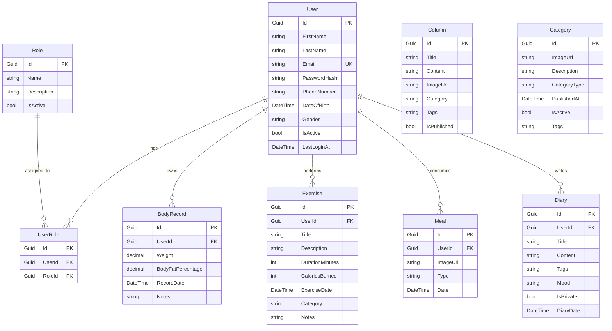

# Database Relationships Documentation - Healthy System

## Overview

The Healthy System uses Entity Framework Core with SQL Server for data management. The database is designed with main entities and appropriate relationships to support user health management.

## Entity Relationship Diagram



## Entity Details

### 1. User
- **Purpose**: Store basic user information
- **Inherits**: `EntityAuditableBase`
- **Key Properties**:
  - `FirstName`, `LastName`: User's first and last name
  - `Email`: Unique email address (Unique Index)
  - `PasswordHash`: Hashed password
  - `PhoneNumber`: Phone number (Indexed)
  - `DateOfBirth`: Date of birth
  - `Gender`: Gender information
  - `IsActive`: Active status
  - `LastLoginAt`: Last login timestamp

### 2. Role
- **Purpose**: Define system roles
- **Inherits**: `EntityBase`
- **Key Properties**:
  - `Name`: Role name (Admin, User, Moderator)
  - `Description`: Role description
  - `IsActive`: Active status

### 3. UserRole (User-Role Junction)
- **Purpose**: Many-to-many junction table between User and Role
- **Inherits**: `EntityAuditableBase`
- **Constraints**: Unique Index on (UserId, RoleId)
- **Cascade Delete**: When User or Role is deleted, corresponding UserRole records are deleted

### 4. BodyRecord
- **Purpose**: Track user's body measurements
- **Inherits**: `EntityAuditableBase`
- **Relationship**: Many-to-One with User
- **Key Properties**:
  - `Weight`: Body weight (0-500kg)
  - `BodyFatPercentage`: Body fat percentage (0-100%)
  - `RecordDate`: Record date
  - `Notes`: Additional notes

### 5. Exercise
- **Purpose**: Record user's exercise activities
- **Inherits**: `EntityAuditableBase`
- **Relationship**: Many-to-One with User
- **Key Properties**:
  - `Title`: Exercise title
  - `Description`: Detailed description
  - `DurationMinutes`: Duration in minutes
  - `CaloriesBurned`: Calories burned (0-10000)
  - `ExerciseDate`: Exercise date
  - `Category`: Exercise category
  - `Notes`: Additional notes

### 6. Meal
- **Purpose**: Track user's meals
- **Inherits**: `EntityAuditableBase`
- **Relationship**: Many-to-One with User
- **Key Properties**:
  - `ImageUrl`: Meal image URL
  - `Type`: Meal type (Morning, Lunch, Dinner, Snack)
  - `Date`: Meal date

### 7. Diary
- **Purpose**: Personal health diary entries
- **Inherits**: `EntityAuditableBase`
- **Relationship**: Many-to-One with User
- **Key Properties**:
  - `Title`: Diary title
  - `Content`: Diary content
  - `Tags`: Tags
  - `Mood`: Mood information
  - `IsPrivate`: Privacy setting
  - `DiaryDate`: Diary date

### 8. Column (Articles)
- **Purpose**: Health articles and news
- **Inherits**: `EntityAuditableBase`
- **Relationship**: Standalone entity
- **Key Properties**:
  - `Title`: Article title
  - `Content`: Article content
  - `ImageUrl`: Featured image
  - `Category`: Category (diet, recommended, beauty)
  - `Tags`: Tags
  - `IsPublished`: Publication status

### 9. Category
- **Purpose**: Content categorization
- **Inherits**: `EntityAuditableBase`
- **Relationship**: Standalone entity
- **Key Properties**:
  - `ImageUrl`: Category image
  - `Description`: Description
  - `CategoryType`: Category type
  - `PublishedAt`: Publication date
  - `IsActive`: Active status
  - `Tags`: Tags

## Base Classes

### EntityBase
- **Properties**: `Id` (Guid, Primary Key)
- **Used by**: Role

### EntityAuditableBase (Inherits EntityBase)
- **Audit Properties**:
  - `CreatedAt`: Creation date
  - `UpdatedAt`: Last update date
  - `CreatedBy`: Creator
  - `UpdatedBy`: Last updater
  - `IsDeleted`: Soft delete flag
  - `DeletedAt`: Deletion date
  - `DeletedBy`: Deleter
- **Used by**: User, UserRole, BodyRecord, Exercise, Meal, Diary, Column, Category

## Indexes and Constraints

### User
- **Unique Index**: Email
- **Index**: PhoneNumber, IsDeleted, CreatedAt

### UserRole
- **Unique Index**: (UserId, RoleId)

### Soft Delete
- All entities inheriting `EntityAuditableBase` have query filter `!IsDeleted`
- No physical deletion, only marking IsDeleted = true

## Cascade Delete Behavior

### User → UserRole
- **DeleteBehavior.Cascade**: When User is deleted, all corresponding UserRole records are deleted

### Role → UserRole  
- **DeleteBehavior.Cascade**: When Role is deleted, all corresponding UserRole records are deleted

### User → BodyRecord/Exercise/Meal/Diary
- **DeleteBehavior**: Default (Restrict) - child records must be deleted first

## Seed Data

### Default Roles:
1. **Admin** (ID: 11111111-1111-1111-1111-111111111111)
2. **User** (ID: 22222222-2222-2222-2222-222222222222)  
3. **Moderator** (ID: 33333333-3333-3333-3333-333333333333)

### Default Users:
1. **System Administrator**
   - Email: admin@healthysystem.com
   - Password: Admin@123
   - Role: Admin

2. **Test User**
   - Email: user@healthysystem.com
   - Password: User@123
   - Role: User

### Sample Columns:
- 5 sample articles about nutrition, beauty, and health

## Connection String Configuration

```plaintext
Server=localhost,1433;Database=HealthyDB_Dev;User Id=sa;Password=Dev@Passw0rd123;TrustServerCertificate=true;
```

## Migrations

- **Auto Migration**: Enabled in Development environment
- **Seed Data**: Automatically executed during database initialization
- **Script**: `scripts/update-database.ps1` for manual database updates

## Technical Notes

1. **Timezone**: All DateTime values are stored in UTC
2. **Password Hashing**: Uses BCrypt
3. **Soft Delete**: Applied to all auditable entities
4. **Connection Pool**: Uses SQL Server connection pooling
5. **Transaction**: Entity Framework automatically manages transactions
6. **Performance**: Appropriate indexes for common queries

## Database Schema Overview

### Core Tables
- **Users**: User accounts and profile information
- **Roles**: System roles (Admin, User, Moderator)
- **UserRoles**: Junction table for user-role assignments

### Health Tracking Tables
- **BodyRecords**: Body measurements (weight, body fat %)
- **Exercises**: Exercise activities and calories burned
- **Meals**: Meal records with images and types
- **Diaries**: Personal health diary entries

### Content Management Tables
- **Columns**: Health articles and news content
- **Categories**: Content categorization system

### Audit Trail
All tables (except Roles) include full audit trail:
- Creation tracking (CreatedAt, CreatedBy)
- Modification tracking (UpdatedAt, UpdatedBy)
- Soft deletion (IsDeleted, DeletedAt, DeletedBy)

## Data Integrity

### Referential Integrity
- Foreign key constraints ensure data consistency
- Cascade deletes for junction tables
- Restrict deletes for main data tables

### Data Validation
- Email uniqueness enforced at database level
- Range validation for numeric fields (weight, calories, etc.)
- Required field constraints
- Maximum length constraints for text fields

### Security Considerations
- GUID primary keys prevent enumeration attacks
- Password hashing with BCrypt
- Soft delete preserves audit trail
- Index on IsDeleted for performance with soft deletes
