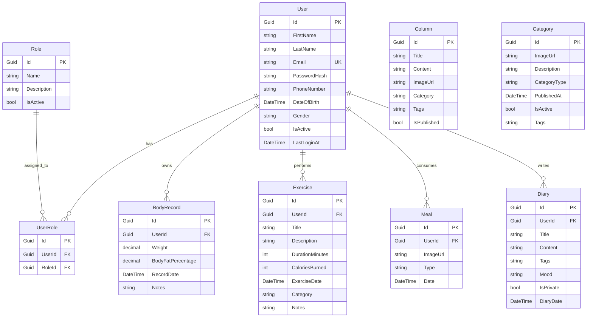

# Database Relationships Documentation - Healthy System

## Overview

The Healthy System uses Entity Framework Core with SQL Server for data management. The database is designed with main entities and appropriate relationships to support user health management.

**Database Version**: HealthyDB  
**Current Migration**: 20250804174116_UpdateSeedData  
**Environment**: Development

## Entity Relationship Diagram



## Entity Details

### 1. User
- **Purpose**: Store basic user information
- **Inherits**: `EntityAuditableBase`
- **Key Properties**:
  - `FirstName`, `LastName`: User's first and last name
  - `Email`: Unique email address (Unique Index)
  - `PasswordHash`: Hashed password
  - `PhoneNumber`: Phone number (Indexed)
  - `DateOfBirth`: Date of birth
  - `Gender`: Gender information
  - `IsActive`: Active status
  - `LastLoginAt`: Last login timestamp

### 2. Role
- **Purpose**: Define system roles
- **Inherits**: `EntityBase`
- **Key Properties**:
  - `Name`: Role name (Admin, User, Moderator)
  - `Description`: Role description
  - `IsActive`: Active status

### 3. UserRole (User-Role Junction)
- **Purpose**: Many-to-many junction table between User and Role
- **Inherits**: `EntityAuditableBase`
- **Constraints**: Unique Index on (UserId, RoleId)
- **Cascade Delete**: When User or Role is deleted, corresponding UserRole records are deleted

### 4. BodyRecord
- **Purpose**: Track user's body measurements
- **Inherits**: `EntityAuditableBase`
- **Relationship**: Many-to-One with User
- **Key Properties**:
  - `Weight`: Body weight (0-500kg)
  - `BodyFatPercentage`: Body fat percentage (0-100%)
  - `RecordDate`: Record date
  - `Notes`: Additional notes

### 5. Exercise
- **Purpose**: Record user's exercise activities
- **Inherits**: `EntityAuditableBase`
- **Relationship**: Many-to-One with User
- **Key Properties**:
  - `Title`: Exercise title
  - `Description`: Detailed description
  - `DurationMinutes`: Duration in minutes
  - `CaloriesBurned`: Calories burned (0-10000)
  - `ExerciseDate`: Exercise date
  - `Category`: Exercise category
  - `Notes`: Additional notes

### 6. Meal
- **Purpose**: Track user's meals
- **Inherits**: `EntityAuditableBase`
- **Relationship**: Many-to-One with User
- **Key Properties**:
  - `ImageUrl`: Meal image URL
  - `Type`: Meal type (Morning, Lunch, Dinner, Snack)
  - `Date`: Meal date

### 7. Diary
- **Purpose**: Personal health diary entries
- **Inherits**: `EntityAuditableBase`
- **Relationship**: Many-to-One with User
- **Key Properties**:
  - `Title`: Diary title
  - `Content`: Diary content
  - `Tags`: Tags
  - `Mood`: Mood information
  - `IsPrivate`: Privacy setting
  - `DiaryDate`: Diary date

### 8. Column (Articles)
- **Purpose**: Health articles and news
- **Inherits**: `EntityAuditableBase`
- **Relationship**: Standalone entity
- **Key Properties**:
  - `Title`: Article title
  - `Content`: Article content
  - `ImageUrl`: Featured image
  - `Category`: Category (diet, recommended, beauty)
  - `Tags`: Tags
  - `IsPublished`: Publication status

### 9. Category
- **Purpose**: Content categorization
- **Inherits**: `EntityAuditableBase`
- **Relationship**: Standalone entity
- **Key Properties**:
  - `ImageUrl`: Category image
  - `Description`: Description
  - `CategoryType`: Category type
  - `PublishedAt`: Publication date
  - `IsActive`: Active status
  - `Tags`: Tags

## Base Classes

### EntityBase
- **Properties**: `Id` (Guid, Primary Key)
- **Used by**: Role

### EntityAuditableBase (Inherits EntityBase)
- **Audit Properties**:
  - `CreatedAt`: Creation date
  - `UpdatedAt`: Last update date
  - `CreatedBy`: Creator
  - `UpdatedBy`: Last updater
  - `DeletedAt`: Soft delete timestamp (nullable)
  - `DeletedBy`: Deleter identifier
  - `IsDeleted`: Computed property (`DeletedAt.HasValue`) - No longer a database column
- **Used by**: User, UserRole, BodyRecord, Exercise, Meal, Diary, Column, Category

## Current Indexes and Constraints

### User Table
- **Unique Index**: Email (prevents duplicate email addresses)
- **Index**: PhoneNumber, CreatedAt, DeletedAt
- ~~**Index**: IsDeleted~~ (Removed - now uses DeletedAt index)

### UserRole Table
- **Unique Index**: (UserId, RoleId) - prevents duplicate role assignments

### Performance Indexes
- **BodyRecords**: RecordDate, UserId, (UserId + RecordDate), DeletedAt
- **Categories**: CategoryType, CreatedAt, IsActive, DeletedAt
- **Exercises**: ExerciseDate, UserId, (UserId + ExerciseDate), DeletedAt
- **Meals**: Date, UserId, (UserId + Date), DeletedAt
- **Diaries**: DiaryDate, UserId, (UserId + DiaryDate), DeletedAt
- **UserRoles**: DeletedAt

### Soft Delete Implementation (Updated August 2025)
- ✅ **Still Active** - Uses `DeletedAt` timestamp approach
- ✅ **Computed Property**: `IsDeleted => DeletedAt.HasValue`
- ✅ **Database Columns**: `DeletedAt` (DateTime?), `DeletedBy` (string?)
- ❌ **Removed**: `IsDeleted` boolean column (replaced with computed property)
- ✅ **Query Filters**: Entities with `DeletedAt != null` are filtered out
- ✅ **Performance**: Indexes on `DeletedAt` for efficient queries

## Cascade Delete Behavior

### User → UserRole
- **DeleteBehavior.Cascade**: When User is deleted, all corresponding UserRole records are deleted

### Role → UserRole  
- **DeleteBehavior.Cascade**: When Role is deleted, all corresponding UserRole records are deleted

### User → BodyRecord/Exercise/Meal/Diary
- **DeleteBehavior**: Default (Restrict) - child records must be deleted first

## Seed Data

### Default Roles:
1. **Admin** (ID: 11111111-1111-1111-1111-111111111111)
2. **User** (ID: 22222222-2222-2222-2222-222222222222)  
3. **Moderator** (ID: 33333333-3333-3333-3333-333333333333)

### Default Users:
1. **System Administrator**
   - Email: admin@healthysystem.com
   - Password: Admin@123
   - Role: Admin

2. **Test User**
   - Email: user@healthysystem.com
   - Password: User@123
   - Role: User

### Sample Columns:
- 5 sample articles about nutrition, beauty, and health

## Connection String Configuration

### Current Configuration (August 5, 2025)

**Development Environment:**
```plaintext
Server=healthy-db,1433;Database=HealthyDB;User Id=sa;Password=Dev@Passw0rd123!;TrustServerCertificate=true;Encrypt=false
```

**Host/Migration Environment:**
```plaintext
Server=localhost,1433;Database=HealthyDB;User Id=sa;Password=Dev@Passw0rd123!;TrustServerCertificate=true;Encrypt=false
```

### Configuration Details
- **Database Name**: HealthyDB (not HealthyDB_Dev)
- **Server**: 
  - Container: `healthy-db` (Docker internal)
  - Host: `localhost:1433` (for migrations and external access)
- **Authentication**: SQL Server Authentication
- **Password**: Dev@Passw0rd123! (with exclamation mark)
- **Security**: TrustServerCertificate=true, Encrypt=false

## Current Migrations Status

### Active Migrations (3 total)
1. **20250803102630_InitialEntitiesAndSeedData** - Initial database schema with all entities and seed data
2. **20250803155957_RemoveIsDeletedColumn** - Replaced `IsDeleted` boolean column with `DeletedAt` timestamp approach for soft delete
3. **20250804174116_UpdateSeedData** - Updated seed data with current values

### Migration Management
- **Auto Migration**: Enabled in Development environment
- **Seed Data**: Automatically executed during database initialization  
- **Manual Script**: `scripts/update-database.ps1` for manual database updates
- **Batch Script**: `update-database.bat` for Windows CMD users

## 📊 Current Database Status (August 5, 2025)

### Live Configuration
| Component | Status | Details |
|-----------|--------|---------|
| **Database** | ✅ Active | HealthyDB on SQL Server 2022 Express |
| **Connection** | ✅ Healthy | Container: healthy-db:1433, Host: localhost:1433 |
| **Migrations** | ✅ Current | 3 migrations applied successfully |
| **Seed Data** | ✅ Loaded | Users, Roles, Sample Content available |
| **Auto Migration** | ✅ Enabled | Automatic on container startup |

### Tables Overview
| Table | Records | Purpose | Status |
|-------|---------|---------|---------|
| **Users** | ~2 | User accounts (Admin, Test User) | ✅ Active |
| **Roles** | 3 | System roles (Admin, User, Moderator) | ✅ Active |
| **UserRoles** | ~2 | User-role assignments | ✅ Active |
| **BodyRecords** | 0 | Body measurements | ✅ Ready |
| **Exercises** | 0 | Exercise tracking | ✅ Ready |
| **Meals** | 0 | Meal records | ✅ Ready |
| **Diaries** | 0 | Personal diary entries | ✅ Ready |
| **Columns** | ~5 | Health articles | ✅ Seeded |
| **Categories** | 0 | Content categories | ✅ Ready |

## Technical Notes

### Current Technical Implementation

1. **Timezone**: All DateTime values are stored in UTC
2. **Password Hashing**: Uses BCrypt with cost factor 11
3. **Soft Delete**: ✅ Active - Uses `DeletedAt` timestamp approach (not boolean column)
4. **Connection Pool**: Uses SQL Server connection pooling
5. **Transaction**: Entity Framework automatically manages transactions
6. **Performance**: Appropriate indexes for common queries including DeletedAt
7. **Entity Framework**: .NET 8 with Entity Framework Core
8. **Database Provider**: Microsoft.EntityFrameworkCore.SqlServer

## Database Schema Overview

### Core Tables
- **Users**: User accounts and profile information
- **Roles**: System roles (Admin, User, Moderator)
- **UserRoles**: Junction table for user-role assignments

### Health Tracking Tables
- **BodyRecords**: Body measurements (weight, body fat %)
- **Exercises**: Exercise activities and calories burned
- **Meals**: Meal records with images and types
- **Diaries**: Personal health diary entries

### Content Management Tables
- **Columns**: Health articles and news content
- **Categories**: Content categorization system

### Audit Trail
Most tables include audit trail information:
- Creation tracking (CreatedAt, CreatedBy)
- Modification tracking (UpdatedAt, UpdatedBy)
- Soft deletion (DeletedAt, DeletedBy with computed IsDeleted property)

**Note**: Soft delete implementation was improved in August 2025 - replaced `IsDeleted` boolean column with `DeletedAt` timestamp approach for better performance and data integrity.

## Data Integrity

### Referential Integrity
- Foreign key constraints ensure data consistency
- Cascade deletes for junction tables
- Restrict deletes for main data tables

### Data Validation
- Email uniqueness enforced at database level
- Range validation for numeric fields (weight, calories, etc.)
- Required field constraints
- Maximum length constraints for text fields

### Security Considerations
- GUID primary keys prevent enumeration attacks
- Password hashing with BCrypt (cost factor 11)
- Soft delete preserves audit trail using `DeletedAt` timestamp
- Indexes on `DeletedAt` for efficient soft delete queries
- Email uniqueness prevents account conflicts
- Foreign key constraints maintain referential integrity

---

## 📝 Changelog

### August 5, 2025
- ✅ **Updated database configuration**: Corrected connection string and database name
- ✅ **Documented migration history**: Added current 3 migrations with descriptions
- ✅ **Clarified soft delete implementation**: Updated to reflect `DeletedAt` timestamp approach
- ✅ **Added current status section**: Live database status and table overview
- ✅ **Updated technical notes**: Reflected current Entity Framework and .NET versions
- ✅ **Enhanced indexes documentation**: Updated to reflect current database schema including DeletedAt indexes
- ✅ **Corrected soft delete documentation**: Clarified that soft delete is still active but uses improved implementation

### Current Database State
- **Active Database**: HealthyDB (SQL Server 2022 Express)
- **Migrations Applied**: 3 (Initial, Improve Soft Delete, Update Seed Data)
- **Soft Delete**: ✅ Active using `DeletedAt` timestamp approach (improved August 2025)
- **Auto Migration**: ✅ Enabled in development
- **Connection**: Container (healthy-db) + Host (localhost:1433)
- **Seeded Data**: Users, Roles, Sample Articles available
